# LifeOS — System Blueprint & Architecture

## 1. Executive Summary

**LifeOS** is a Personal Life Operating System that monitors, controls, optimizes, and improves every area of life through a modular, domain-driven backend (Django + DRF), modern frontend (React + Tailwind), and Azure-hosted infrastructure with full CI/CD.

---

## 2. High-Level Architecture Diagram

```mermaid
flowchart TB
    subgraph Client["🖥 Client Layer"]
        Web["React PWA"]
        Mobile["Mobile (Future)"]
    end

    subgraph Gateway["🔐 Gateway Layer"]
        CDN["Azure CDN"]
        WAF["WAF / Rate Limit"]
        APIM["API Gateway (optional)"]
    end

    subgraph App["⚙️ Application Layer - Azure App Service"]
        subgraph Django["Django + DRF"]
            API["REST API v1"]
            GQL["GraphQL (Strawberry)"]
            Auth["JWT + MFA"]
            Audit["Audit Logging"]
        end
        Worker["Celery Workers"]
    end

    subgraph Data["📦 Data Layer"]
        PG["Azure PostgreSQL"]
        Redis["Azure Cache for Redis"]
        Blob["Azure Blob (files)"]
    end

    subgraph Services["☁️ Azure Services"]
        KV["Key Vault"]
        Monitor["Azure Monitor"]
        Insights["App Insights"]
        Scheduler["Logic Apps / Scheduler"]
    end

    Web --> CDN
    Mobile --> CDN
    CDN --> WAF
    WAF --> Django
    Django --> PG
    Django --> Redis
    Django --> Blob
    Django --> KV
    Worker --> PG
    Worker --> Redis
    Worker --> KV
    Django --> Insights
    Worker --> Insights
    Scheduler --> Django
```

---

## 3. Domain-Driven Module Layout

---

## 4. Data Flow & Security

- **Zero-trust**: Every request validated; no implicit trust.
- **Encryption**: TLS in transit; Azure PostgreSQL encryption at rest.
- **Secrets**: All secrets in Key Vault; app reads via managed identity or env.

---

## 5. Technology Stack Summary

| Layer        | Technology                          |
|-------------|--------------------------------------|
| Backend     | Django 5.x, DRF, Strawberry GraphQL  |
| Database    | PostgreSQL 15+ (Azure)              |
| Cache/Queue | Redis (Azure Cache for Redis)       |
| Tasks       | Celery + Redis broker               |
| Auth        | JWT (djangorestframework-simplejwt), MFA (django-mfa2 or TOTP) |
| Frontend    | React 18, Tailwind, PWA (Vite)       |
| Containers  | Docker, Azure Container Registry     |
| Hosting     | Azure App Service (Linux containers) |
| IaC         | Bicep (primary) or Terraform         |
| CI/CD       | GitHub Actions (test, lint, deploy)  |
| Monitoring  | Azure Monitor, Application Insights  |

---

## 6. API Strategy

- **REST (DRF)**: Primary API; versioned (`/api/v1/`); OpenAPI 3.x.
- **GraphQL (Strawberry)**: For complex/dashboard queries and flexible client needs.
- **Versioning**: URL path versioning; deprecation headers and docs.

---

## 7. MVP Scope (Phase 1 — Core MVP)

Phase 1 focuses on **foundation + 2–3 domains** to validate architecture and deliver value quickly.

### In scope for Phase 1

| Area              | Deliverable |
|-------------------|------------|
| **Project**       | Modular Django project, Docker, docker-compose, env-based config |
| **Auth**          | User model, JWT login/refresh, registration, password reset |
| **Core**          | Audit logging middleware, health check, feature flags (django-flags or env) |
| **Productivity**  | Tasks (GTD-style), daily planner (today view), priority (Eisenhower) |
| **Habits**        | Habit definitions, daily check-ins, streak calculation |
| **Finance**       | Expense entries, categories, simple monthly budget, basic report |
| **API**           | REST only for MVP; OpenAPI schema; pagination, filters |
| **Database**      | PostgreSQL schema for users, audit, productivity, habits, finance |
| **DevOps**        | GitHub Actions: lint, test, build Docker, push to ACR; optional deploy to App Service |
| **Docs**          | README, ARCHITECTURE.md, API overview, local run guide |

### Explicitly out of scope for Phase 1

- GraphQL, AI coach, automation engine, calendar integration, Pomodoro UI, full dashboard widgets, Azure IaC deploy, mobile app, MFA (can be Phase 2).

### Phase 1 success criteria

- User can register, log in, create tasks and habits, log expenses.
- APIs are documented (OpenAPI) and covered by tests.
- App runs via `docker-compose up` with PostgreSQL + Redis.
- CI runs on push (lint + tests).

---

## 8. Roadmap (Phases 2–5)

| Phase   | Focus              | Key additions |
|---------|--------------------|---------------|
| **Phase 2** | Automation        | IFTTT-style rules, smart routines, reminders, Azure Scheduler/Logic Apps |
| **Phase 3** | AI Coach          | Weekly analysis, “what should I do now?”, pattern detection, recommendations |
| **Phase 4** | Optimization      | Life dashboard, scores, heatmaps, forecasting, full analytics |
| **Phase 5** | Mobile            | React Native or PWA-first; push notifications, offline support |

---

## 9. Development Rules (Recap)

- **Code**: PEP 8, type hints, SOLID, DRY, KISS.
- **Tests**: Pytest; ~90% coverage target; unit + integration.
- **API**: Versioned (`/api/v1/`), OpenAPI, consistent errors.
- **Features**: Feature flags for risky or incremental rollouts.
- **Security**: No secrets in code; rate limiting; audit for sensitive actions.

---

## 10. Next Steps

1. **Confirm Phase 1 scope** (this document + MVP_SCOPE.md).
2. **Implement Phase 1** incrementally: project scaffold → auth → core → productivity → habits → finance → Docker → CI/CD → docs.
3. After Phase 1: review, then proceed to Phase 2 (Automation) with your approval.

See **MVP_SCOPE.md** for detailed Phase 1 user stories and database schema.
