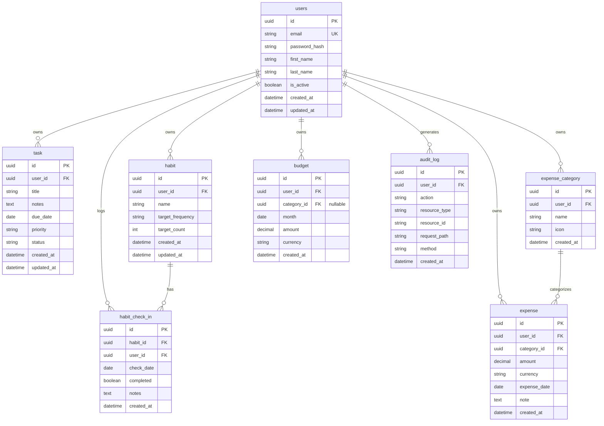

# LifeOS — Database Schema

## Phase 1 (MVP) Entity Relationship Diagram

## Priority & Status Enums (Phase 1)

- **Task priority (Eisenhower)**: `urgent_important`, `urgent_not_important`, `not_urgent_important`, `not_urgent_not_important`
- **Task status**: `todo`, `in_progress`, `done`, `cancelled`
- **Habit target_frequency**: `daily`, `weekly`, `custom`

## Indexes (Recommendations)

- `task(user_id, due_date, status)` for today/planner queries
- `habit_check_in(habit_id, check_date)` unique per user
- `expense(user_id, expense_date)`, `expense(category_id, expense_date)`
- `audit_log(user_id, created_at)`
